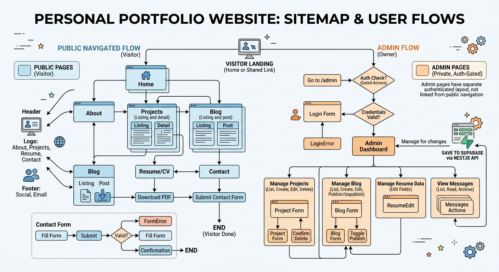

# jannalomibao.github.io

Personal portfolio for Janna Lomibao — software developer career site (recruiter-facing
projects, writing, resume, contact). Live at **<https://jannalomibao.github.io/>**.



## Repo layout

```text
docs/       Planning docs — PRD, user flow/sitemap, design system, user stories, architecture
frontend/   The actual site: React + Vite + TypeScript + Tailwind CSS v4
backend/    NestJS API — public reads, admin auth + CRUD, contact (see docs/07-api-contract.md)
supabase/   Supabase CLI config + SQL migrations (schema source of truth)
devops/     Deployment infra: Terraform (GitHub Pages config) + the deploy script
e2e/        Playwright end-to-end tests (per-story, written by the `/build` skill)
.github/    GitHub Actions workflow that builds and deploys the frontend on push
docker-compose.yml   Local dev orchestration for frontend + backend
```

Start with [`docs/01-project.init.md`](docs/01-project.init.md) for the running checklist of
what's built vs. still planned. Individual docs:

- [PRD](docs/02-prd.md) — goals, scope, functional/non-functional requirements
- [User Flow & Sitemap](docs/03-user-flow-sitemap.md) — routes, visitor flow, admin flow (mermaid)
- [Design System](docs/04-design-system.md) — colors, type, spacing, components, motion — written
  from the actual implemented code, not aspirational
- [User Stories & UAC](docs/05-user-stories.md) — every requirement broken into stories with
  acceptance criteria, technical approach, and honest build status per story
- [Architecture & Infrastructure](docs/06-architecture-infrastructure.md) — NestJS + Supabase +
  Docker plan; `backend/` implements steps 1–5 of its sequencing plan (public reads, admin auth,
  admin CRUD), step 6 (contact) done except real email delivery
- [API Contract](docs/07-api-contract.md) — request/response schemas, validation, error format,
  and rate limits for every backend endpoint — all implemented except resume PDF upload
- [Code reviews](docs/code-reviews/) — dated reports from the project's `/code-review` skill
- [Feature stories](docs/tasks/) — one file per feature, drafted via the project's `/new-story`
  skill from [`docs/templates/01-story-template.md`](docs/templates/01-story-template.md).
  `/build {task_id}` implements one end to end (backend → frontend → tests) and moves it to
  [`docs/tasks/done/`](docs/tasks/done/) when its UACs are verified — see
  [`docs/tasks/000-progress.md`](docs/tasks/000-progress.md) for the changelog and what's left.

## Local setup

Requires Node 20+.

### Frontend only (still all mock data — this is enough for most UI work)

```bash
cd frontend
npm install
npm run dev        # http://localhost:5173
```

To type-check and build for production:

```bash
npm run build       # outputs to frontend/dist
npm run preview     # serve that build locally
```

See [`frontend/README.md`](frontend/README.md) for the file structure and where content lives.

### Frontend + backend (requires Docker)

```bash
supabase start                 # local Postgres/Auth/Storage stack
cp .env.example .env            # then set ADMIN_USER_ID (see backend/README.md "Admin auth")
docker compose up --build      # frontend :5173, backend :3000
```

`docker compose up` fails fast with a clear message if `ADMIN_USER_ID` isn't set — there's no
usable default since it's the specific owner account id created on your machine.

See [`backend/README.md`](backend/README.md) for backend-only setup (no Docker), how to create
the local admin account and get a token to test admin routes, schema-change workflow, and a few
real gotchas hit while building it (worth reading before touching `Dockerfile`,
`prisma/schema.prisma`, or `admin.guard.ts`).

### End-to-end tests

```bash
cd e2e
npm install && npx playwright install chromium   # once
npx playwright test         # frontend dev server auto-starts if not already running
npx playwright show-report  # view the HTML report
```

Written per-story by the `/build` skill against `docs/tasks/`, covering both a desktop and a
mobile viewport for every spec. See [`docs/tasks/000-progress.md`](docs/tasks/000-progress.md)
for what's been built and verified so far.

## Deploying

Full one-time setup and troubleshooting live in [`devops/README.md`](devops/README.md). Short
version, once set up:

```bash
./devops/deploy.sh
```

This builds locally (so a broken build fails before it ever reaches GitHub), commits, and
pushes to `main`. That push triggers `.github/workflows/deploy.yml`, which builds the site
fresh in CI and publishes it via GitHub Actions → GitHub Pages. No manual upload step, no
`gh-pages` branch to manage by hand.

Terraform (`devops/terraform/`) is separate from that — it's one-time infrastructure
configuration (turns on GitHub Pages with "GitHub Actions" as the build source) and only needs
re-running if you change *how* Pages is configured, not on every deploy.

## Things to remember

- **A newly-created/edited project skill (`.claude/skills/*/SKILL.md`) may not resolve in the
  same session you created it in.** Confirmed with `/code-review` — it kept loading the
  built-in generic skill even after the project override existed, in the same conversation. If
  a project skill (including `/new-story` or `/build`) doesn't seem to take effect right after
  creating it, try a fresh session before assuming the file is wrong.

- **`ParallaxImage` puts its scroll-driven `translateY` on a wrapping `motion.div`, never on the
  same element as a Tailwind `transform` class (e.g. `group-hover:scale-105`).** Framer Motion
  writes its own inline `style.transform`, which silently clobbers a CSS-class-driven transform
  on the same element rather than composing with it. Two separate elements, each owning one
  transform, is the fix — don't collapse them to "simplify" the component.

- **Repo name is load-bearing.** This must stay named exactly `jannalomibao.github.io` — GitHub
  only serves a repo at the bare domain root (instead of `/repo-name/`) when the name matches
  the account exactly. If you ever rename it, `frontend/vite.config.ts` needs a `base` path and
  `frontend/public/404.html`'s `pathSegmentsToKeep` needs updating (see next point).

- **Client-side routing needs the 404.html trick.** The site uses React Router
  (`BrowserRouter`), but GitHub Pages only serves static files — a direct link to e.g.
  `/projects/ledgerline` 404s at the CDN before React loads. `frontend/public/404.html` plus a
  decode snippet in `frontend/index.html` work around this (the
  [rafgraph/spa-github-pages](https://github.com/rafgraph/spa-github-pages) technique). Don't
  delete either half without replacing client-side routing with hash routing instead.

- **`gh` needs two things beyond plain login to push here:**
  - `gh auth setup-git` — registers `gh` as git's credential helper. Without it, HTTPS pushes
    fail with "Password authentication is not supported."
  - The `workflow` scope — without it, pushes touching `.github/workflows/**` are rejected by
    GitHub even if you're otherwise authenticated. Fix with:
    `gh auth refresh -h github.com -s workflow` (requires a one-time browser authorization).

- **Terraform state is local and gitignored.** There's no remote backend — `*.tfstate` lives
  only on whatever machine ran `terraform apply`. Fine for a single-maintainer project, but
  don't delete it carelessly, and don't run `terraform apply` from a second machine without
  copying state over first (or it'll try to recreate resources that already exist).

- **Backend has public reads, admin auth + CRUD, and contact — but the frontend calls none of
  it.** `backend/` implements the full API contract against a real Postgres schema
  (`supabase/migrations/`) except resume PDF upload and real email delivery (contact
  notifications currently log a stub). Every route has been exercised with real HTTP requests
  against a running local Supabase stack, including auth failure modes and the containerized
  path — not just written and assumed correct. The frontend is still entirely on mock data
  (`frontend/src/data/content.ts`; contact form just simulates success) and there's no admin UI
  at all — that's User Story 7.2 and the rest of Epic 6, not done.

- **Admin auth is JWKS-based (asymmetric), not a shared secret.** This was wrong in an earlier
  version and only caught by testing against a real locally-issued token — see `backend/README.md`
  "Admin auth" and "Gotchas" before touching `backend/src/auth/admin.guard.ts`.

- **Design system is descriptive, not aspirational.** `docs/04-design-system.md` documents
  what's actually in the code (colors, type scale, component patterns). If you change a token
  in `frontend/src/index.css`, update the doc in the same change, not later.

## Tech stack

React 19 · Vite 8 · TypeScript · Tailwind CSS v4 · React Router · Framer Motion · lucide-react
· NestJS · Prisma · Supabase (Postgres) · Docker · Terraform (`integrations/github` provider) ·
GitHub Actions · GitHub Pages
