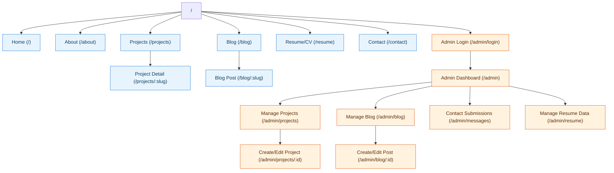
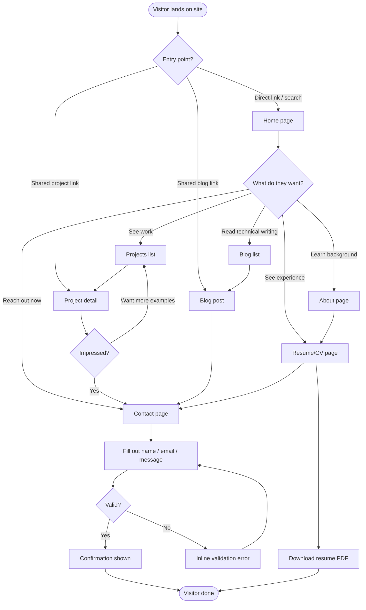
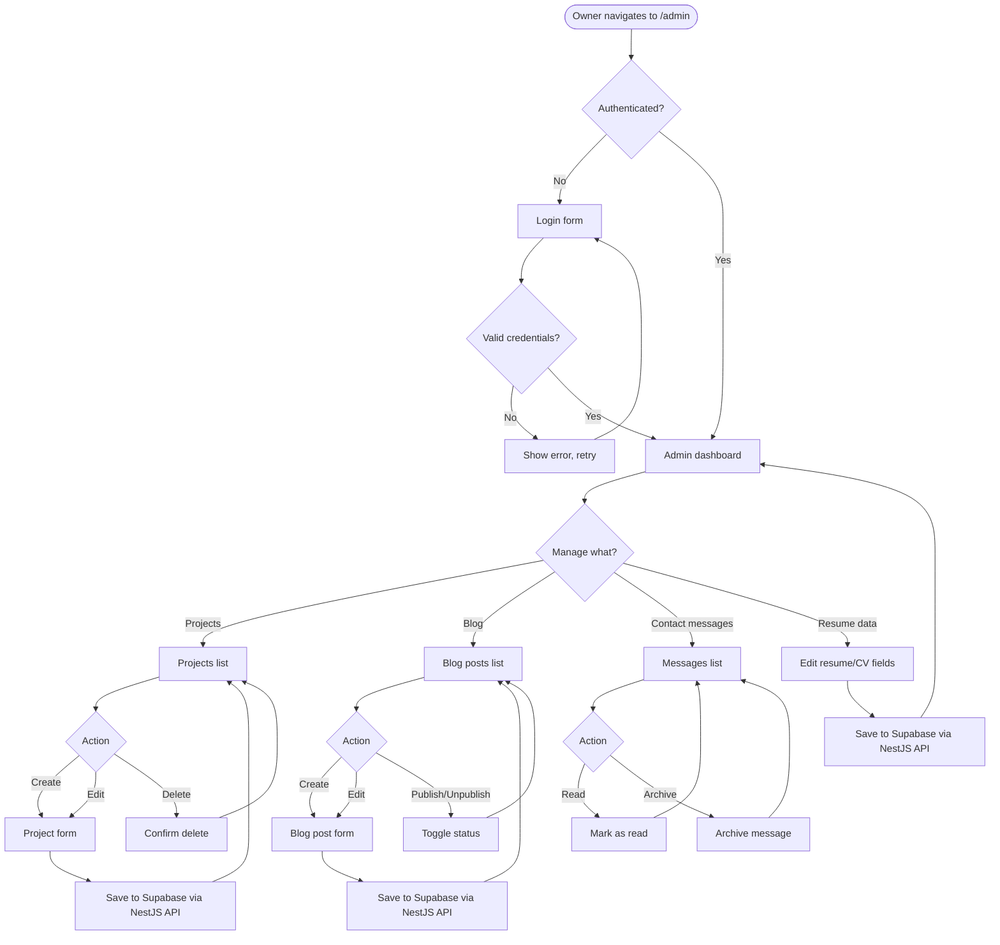

# User Flow & Sitemap — Personal Portfolio Website

Related: [PRD](02-prd.md)

## 1. Sitemap

**Legend:** blue = public pages, orange = admin (auth-gated) pages.

### Route table

| Path | Page | Access |
|---|---|---|
| `/` | Home | Public |
| `/about` | About | Public |
| `/projects` | Projects list | Public |
| `/projects/:slug` | Project detail (case study) | Public |
| `/blog` | Blog list | Public |
| `/blog/:slug` | Blog post detail | Public |
| `/resume` | Resume/CV (view + download PDF) | Public |
| `/contact` | Contact form | Public |
| `/admin/login` | Admin login | Public (form), redirects if authed |
| `/admin` | Admin dashboard (overview) | Private |
| `/admin/projects` | Manage projects (list) | Private |
| `/admin/projects/:id` | Create/edit project | Private |
| `/admin/blog` | Manage blog posts (list) | Private |
| `/admin/blog/:id` | Create/edit blog post | Private |
| `/admin/messages` | View contact submissions | Private |
| `/admin/resume` | Edit resume/CV data | Private |

## 2. Primary Visitor Flow (Recruiter / Hiring Manager)

## 3. Admin (CMS) Flow

## 4. Global Navigation

Present on every public page (header/footer):

- Logo/name → `/`
- Nav links: About, Projects, Blog, Resume, Contact
- Footer: social links (GitHub, LinkedIn), email, copyright

Admin pages use a separate authenticated layout (sidebar nav: Dashboard, Projects, Blog,
Messages, Resume) and are not linked from the public nav.
