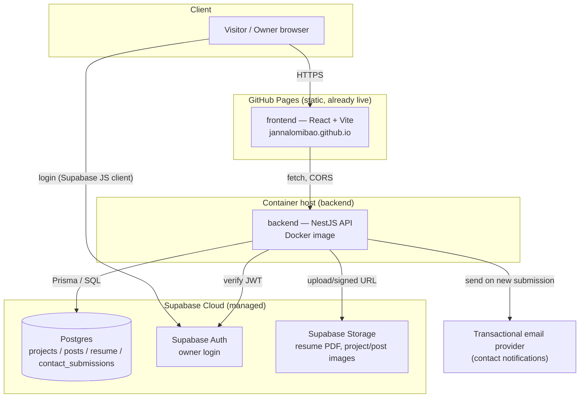
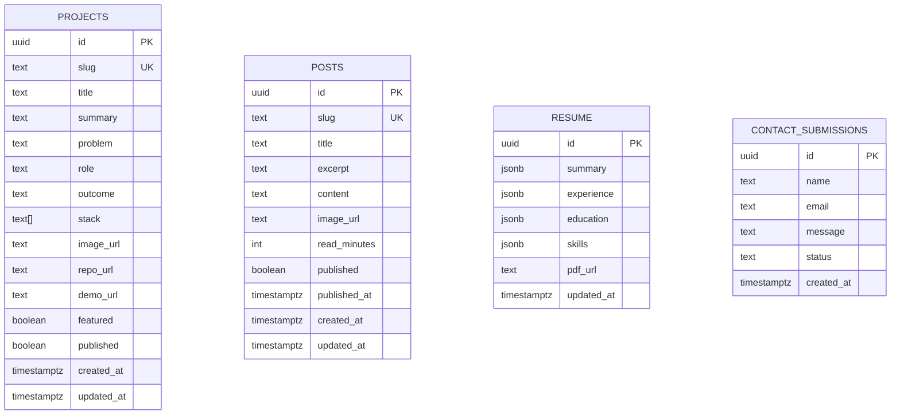

# Architecture & Infrastructure — Personal Portfolio Website

Related: [PRD](02-prd.md) · [User Flow & Sitemap](03-user-flow-sitemap.md) · [User Stories](05-user-stories.md)

This doc defines the target architecture for Epics 2.3–7.2 in the user stories (everything
currently ⬜ Not started) and closes the three open questions from [PRD §10](02-prd.md#10-open-questions).
It does not re-describe the frontend, which is already built — see
[`frontend/README.md`](../frontend/README.md).

## 1. Component Overview



**Why the frontend and backend deploy separately:** the frontend already works well and for
free on GitHub Pages (static hosting, no server). NestJS needs a real running process, which
GitHub Pages cannot provide — so the backend is a separate containerized service on its own
host. This is a deliberate split, not a compromise: it keeps the free, zero-maintenance static
hosting for the frontend and only pays for compute where compute is actually required.

## 2. Components

| Component | Tech | Responsibility |
|---|---|---|
| `frontend/` | React + Vite + TS (existing) | Public site + admin UI. Fetches from `backend/` instead of `src/data/content.ts` once this is built (User Story 7.2). |
| `backend/` | NestJS (Node.js) | Single REST API: public reads (projects/posts/resume), public write (contact form), admin CRUD (auth-gated). Owns the DB schema via migrations. |
| Database | Supabase Postgres | Persistence for all dynamic content (FR-12). |
| Auth | Supabase Auth | Owner login only (single user, no public signup). |
| Storage | Supabase Storage | Resume PDF, project/post images if moved off Unsplash placeholders later. |
| Email | Transactional email provider (Resend) | Notifies the owner when a contact submission arrives (FR-14). |

## 3. Data Model

Four tables, owned and migrated by the NestJS backend (not Supabase's auto-generated
PostgREST layer — see [§6](#6-why-nestjs-owns-the-schema-instead-of-using-supabases-rest-layer)).



Notes:
- `resume` is a single-row table (the whole resume is one record) — simplest model matching
  User Story 4.2; no need for a multi-version history in v1.
- `contact_submissions.status` is an enum-like text field: `unread` / `read` / `archived`
  (User Story 5.2's UAC).
- `projects.stack` / resume's `experience`/`education`/`skills` use array/`jsonb` columns rather
  than separate join tables — the data is owner-authored and low-cardinality; normalizing further
  would add migration/API surface for no real benefit at this scale.
- Owner identity lives entirely in Supabase Auth's own `auth.users` — no separate `users` table
  needed for a single-admin site (PRD Non-Goal: no multi-author support).

## 4. API Surface

Base path `/api`. Public routes require no auth; Admin routes require a valid Supabase session
(verified per [§5](#5-authentication)).

| Method & Path | Access | Maps to |
|---|---|---|
| `GET /api/projects` | Public | 2.1 (published only) |
| `GET /api/projects/:slug` | Public | 2.2 (published only) |
| `GET /api/posts` | Public | 3.1 (published only) |
| `GET /api/posts/:slug` | Public | 3.1 (published only) |
| `GET /api/resume` | Public | 4.1 |
| `GET /api/resume/pdf` | Public | 4.1 (redirects to signed Storage URL) |
| `POST /api/contact` | Public, rate-limited | 5.1 |
| `GET /api/admin/projects` | Admin | 2.3 (includes unpublished/drafts) |
| `POST /api/admin/projects` | Admin | 2.3 |
| `PATCH /api/admin/projects/:id` | Admin | 2.3 |
| `DELETE /api/admin/projects/:id` | Admin | 2.3 |
| `GET /api/admin/posts` | Admin | 3.2 |
| `POST /api/admin/posts` | Admin | 3.2 |
| `PATCH /api/admin/posts/:id` | Admin | 3.2 |
| `DELETE /api/admin/posts/:id` | Admin | 3.2 |
| `PATCH /api/admin/resume` | Admin | 4.2 |
| `POST /api/admin/resume/pdf` | Admin | 4.2 (upload, stored via Supabase Storage) |
| `GET /api/admin/contact` | Admin | 5.2 |
| `PATCH /api/admin/contact/:id` | Admin | 5.2 (status change) |

Each resource is a standalone NestJS module (`ProjectsModule`, `PostsModule`, `ResumeModule`,
`ContactModule`) with its own controller/service/DTOs — no shared "god module." `AdminGuard`
(§5) is applied at the controller level on every `/api/admin/*` route, not per-method, so a new
admin endpoint is protected by default rather than by remembering to add the guard.

## 5. Authentication

**Decision (closes PRD §10):** Supabase Auth, single hardcoded owner account (email/password),
created once directly in the Supabase dashboard — no public sign-up flow exists anywhere in the
app.

Flow:
1. Owner logs in via the Supabase JS client directly from the frontend admin login page.
   Supabase issues a JWT; the frontend stores the session (Supabase JS handles this) and attaches
   the JWT as a `Bearer` token on every request to `backend/`.
2. NestJS validates the JWT on every `/api/admin/*` request via an `AdminGuard`: verifies the
   token's signature against Supabase's JWKS endpoint and checks the `sub` claim matches the
   one known owner user ID (an env var, not a role system — there is exactly one admin, per the
   PRD's explicit non-goal of multi-author support).
3. No session state is kept in the NestJS backend itself — it's a stateless verifier, matching
   User Story 6.2's requirement that mutation is impossible without a valid token regardless of
   what the frontend does.

This avoids building or hosting any custom auth (password hashing, reset flows, session
storage) — Supabase Auth already solves that, and a hand-rolled equivalent would be pure risk
for a single-user login with no corresponding benefit.

## 6. Why NestJS owns the schema instead of using Supabase's REST layer

Supabase auto-generates a REST API (PostgREST) directly over the Postgres schema. This project
deliberately does **not** use that as the primary API, and instead has NestJS own the schema
(via Prisma migrations) and expose its own REST surface. Reasons:

- The PRD explicitly wants a NestJS backend as part of the demonstrated stack (PRD §8, §2) — not
  just Supabase-as-a-backend with NestJS as a thin unnecessary layer in front of it.
- Business rules (e.g. "don't return unpublished posts on the public route," rate-limiting the
  contact form, triggering an email on a new submission) belong in application code, not as
  Postgres RLS policies and triggers — easier to read, test, and reason about in NestJS.
- One clear API surface (§4) instead of two (PostgREST + a partial NestJS layer) avoids the
  frontend needing to know which backend serves which resource.

Supabase in this architecture = managed Postgres + Auth + Storage. Its auto-REST feature is
simply unused.

## 7. Local Development

Everything runs via Docker Compose (NFR-4), including a full local Supabase stack via the
Supabase CLI (`supabase start`), which is itself Docker Compose under the hood — this gives
local Postgres + Auth + Storage that mirror production, instead of a hand-rolled local Postgres
that risks drifting from Supabase's actual behavior (especially Auth, which has enough
Supabase-specific behavior — JWT shape, `auth.users` — that a generic Postgres substitute would
be a poor stand-in).

```
docker-compose.yml           # orchestrates frontend + backend against local Supabase
supabase/
  config.toml                 # Supabase CLI config (auth, storage, ports)
  migrations/                 # SQL migrations, source of truth for schema
frontend/
  Dockerfile                  # dev: vite dev server; prod: static build
backend/
  Dockerfile                  # NestJS, multi-stage (build → slim runtime image)
```

Local flow: `supabase start` (local Supabase stack) → `docker compose up` (frontend + backend,
pointed at the local Supabase URL/keys via `.env`) → frontend on `localhost:5173`, backend on
`localhost:3000`, Supabase Studio on its default local port for inspecting data.

## 8. Production Deployment

| Piece | Where | How |
|---|---|---|
| Frontend | GitHub Pages | Already live — unchanged. See [`devops/README.md`](../devops/README.md). |
| Backend | A container host (e.g. Fly.io or Railway — either works; pick one when this is built, the Dockerfile doesn't care which) | Docker image built by CI, deployed on push to `main` for `backend/**` changes, mirroring the existing frontend workflow's shape. |
| Database / Auth / Storage | Supabase Cloud (managed, free tier is sufficient at this scale) | No self-hosting — self-hosting Supabase via Docker is supported but is meaningfully more ops overhead than this single-user portfolio project justifies. Local dev still uses the Dockerized Supabase CLI stack (§7); only production skips self-hosting. |
| Email | Resend (or equivalent) | Backend calls its API on new contact submissions. |

**CORS:** the backend must allow the frontend's origin (`https://jannalomibao.github.io`)
explicitly — no wildcard `*`, since the admin routes carry bearer tokens and a permissive CORS
policy would widen the attack surface for no benefit.

**Secrets:** Supabase service-role key, JWT/JWKS config, and the email provider API key are
backend-only environment variables, injected at deploy time by the container host's secret
store — never committed, never sent to the frontend. The frontend only ever holds the Supabase
**anon/public** key (safe to expose; Supabase's RLS and this project's own NestJS-side checks are
what actually gate access, not secrecy of that key).

## 9. Open Questions Resolved

Closing [PRD §10](02-prd.md#10-open-questions):

- **Resume PDF source of truth:** manual upload via the admin dashboard (`POST
  /api/admin/resume/pdf`) to Supabase Storage, not generated from CMS data. Simpler to ship, and
  "does the PDF match the page" is the owner's responsibility at edit time — an
  automatically-generated PDF is a reasonable v2 if drift becomes an actual problem in practice.
- **Contact notification channel:** email via a transactional provider (Resend). Chosen over
  Slack/in-dashboard-only because the owner needs to notice a new recruiter message promptly and
  won't necessarily have the admin dashboard open.
- **Admin auth mechanism:** Supabase Auth, single hardcoded owner account, no public sign-up —
  see [§5](#5-authentication).

## 10. Target Repo Structure

```text
docs/                  Planning docs (this file and its siblings)
devops/                Deployment infra — Terraform (GitHub Pages) + deploy.sh (existing)
frontend/              React + Vite (existing)
backend/               NestJS API (new)
  src/
    projects/
    posts/
    resume/
    contact/
    auth/              AdminGuard, JWT verification against Supabase
  Dockerfile
supabase/               Supabase CLI config + SQL migrations (new)
.github/workflows/
  deploy.yml            Frontend → GitHub Pages (existing, unchanged)
  deploy-backend.yml    Backend → container host (new, mirrors deploy.yml's shape)
docker-compose.yml      Local dev orchestration (new)
```

## 11. Sequencing

Recommended build order, following the dependency chain already implied by the user stories:

1. `supabase/` migrations for the four tables (§3) + local Supabase stack running.
2. `backend/` skeleton with the public read routes (`GET /api/projects`, `/api/posts`,
   `/api/resume`) — no auth needed yet, unblocks frontend integration early.
3. Frontend data-fetching layer (User Story 7.2) swapped in behind the existing `content.ts`
   types, so this is a data-source change, not a page rewrite.
4. `AdminGuard` + Supabase Auth login screen (Epic 6).
5. Admin CRUD routes + admin UI, one resource at a time: projects → posts → resume → contact
   (roughly rising complexity/lowest-risk-first).
6. Contact form wired to `POST /api/contact` + email notification (Epic 5).
7. `deploy-backend.yml` + container host setup, mirroring the existing frontend deploy pattern.

This order means the site keeps working (on mock data, then on real public data) at every step
rather than needing a big-bang cutover at the end.
