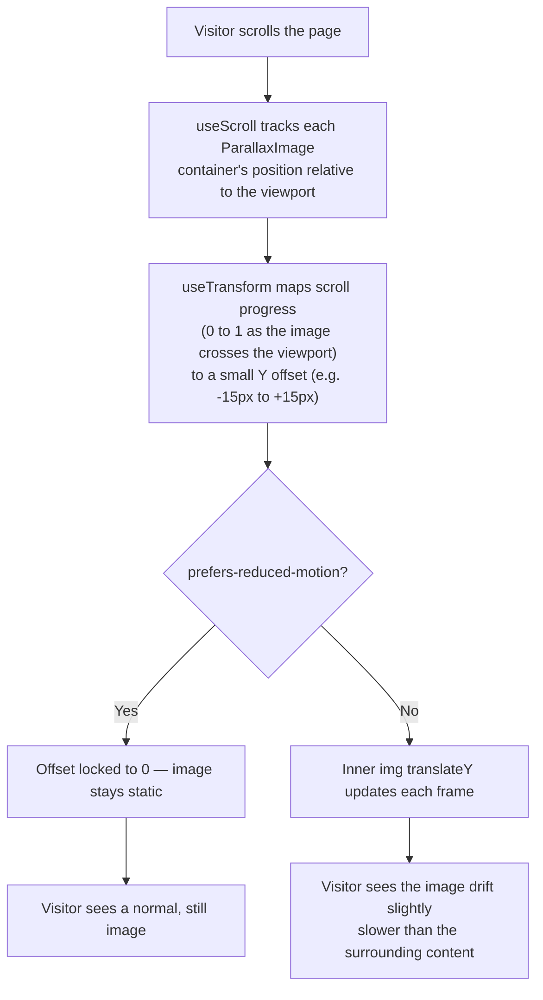

# Goal

As a visitor browsing the portfolio, I want images throughout the site to drift subtly as I
scroll, so that the site feels more dynamic and considered without undermining its minimalist,
"motion confirms, it doesn't perform" design language ([`docs/04-design-system.md`](../04-design-system.md) §1, §8).

## Description

- **What it is:** a subtle scroll-driven depth-parallax effect applied site-wide to every image
  currently rendered from the Unsplash mock data
  ([`frontend/src/data/content.ts`](../../frontend/src/data/content.ts)) — e.g. the Home
  "About teaser" photo (`photo-1519389950473-...`), the About page desk photo
  (`photo-1483058712412-...`), `ProjectCard` images used on Home + Projects
  (`photo-1554224155-...`, `photo-1481627834876-...`, `photo-1551288049-...`,
  `photo-1517180102446-...`), the `ProjectDetail` hero image, and the Blog list/`BlogDetail`
  images (`photo-1461749280684-...`, `photo-1667372393119-...`, `photo-1517694712202-...`). As
  each image scrolls through the viewport, it moves slightly slower than the surrounding page —
  the classic parallax illusion of depth.
- **How it's driven:** Framer Motion's `useScroll` + `useTransform` (already a project
  dependency — no new library), mirroring how `Reveal.tsx` already uses `whileInView` for the
  same "as it enters the viewport" trigger. A new shared `ParallaxImage` component wraps the
  existing image markup pattern (fixed-aspect box, `object-cover`, rounded corners — design
  system §6) so the parallax offset is applied to the `` inside that box without changing
  the box's own clipping/sizing rules.
- **Intensity:** subtle — roughly 10–30px of vertical drift, not a dramatic depth effect. This
  is a deliberate constraint from the design system's existing motion principle, not a new one
  invented for this feature.
- **Accessibility:** when the OS `prefers-reduced-motion` setting is on, the parallax offset is
  disabled entirely (image renders static) — same spirit as the existing custom cursor and
  marquee being decorative-only and never blocking use of the underlying page (design system
  §10).
- **Performance:** driven by GPU-accelerated `transform: translateY(...)`, not layout-affecting
  properties, so it stays smooth on both desktop and mobile scroll — no per-frame layout thrash.



- **ASCII layout** — the parallax container clips to the existing fixed-aspect box; the image
  itself is rendered slightly taller than the box and translated within it, so it never escapes
  the rounded corners it already has today:

```text
  ┌─ ParallaxImage (existing aspect box, overflow-hidden, rounded-2xl) ─┐
  │                                                                     │
  │   ┌───────────────────────────────────────────────────────────┐   │ ← image is taller
  │   │                                                             │   │   than the box;
  │   │               — object-cover, translateY(offset)       │   │   only the offset
  │   │                                                             │   │   changes, not the
  │   └───────────────────────────────────────────────────────────┘   │   box size
  │                                                                     │
  └─────────────────────────────────────────────────────────────────┘
        scroll ↑ → offset drifts toward -15px   |   scroll ↓ → drifts toward +15px
```

## UACs

All six verified by `e2e/tests/001-scroll-parallax-images.spec.ts`, run against both a desktop
and a mobile viewport (Playwright's `chromium` and `mobile-chromium` projects) — 20/20 passing.

- ~~Demo that scrolling past the Home "About teaser" image shows it drifting at a visibly
  different (slower) rate than the surrounding text as it crosses the viewport.~~
- ~~Demo that the same holds for the About page photo, every `ProjectCard` image on Home and
  Projects, the `ProjectDetail` hero image, and the Blog list + `BlogDetail` images — site-wide,
  not just one page.~~
- ~~Demo that the drift stays subtle (roughly 10–30px) — comparable in restraint to the existing
  `Reveal` scroll-entrance animation, not a dramatic depth effect.~~
- ~~Demo that every image stays correctly clipped inside its existing rounded aspect-ratio box at
  every scroll position — no image ever visibly escapes its container or causes a layout shift.~~
- ~~Demo that with the OS "reduce motion" setting enabled, images render fully static (no
  translateY drift) while remaining otherwise identical and fully visible.~~
- ~~Demo that scrolling the Projects or Blog list (the pages with the most images on screen at
  once) stays smooth on both a desktop browser and a mobile viewport size, with no visible jank.~~
  Verified as a proxy (zero console/page errors and the page stays interactive through a scroll
  burst on both viewports) — this is not a literal frame-timing/jank measurement, which would
  need performance-trace tooling beyond a reasonable Playwright assertion.
