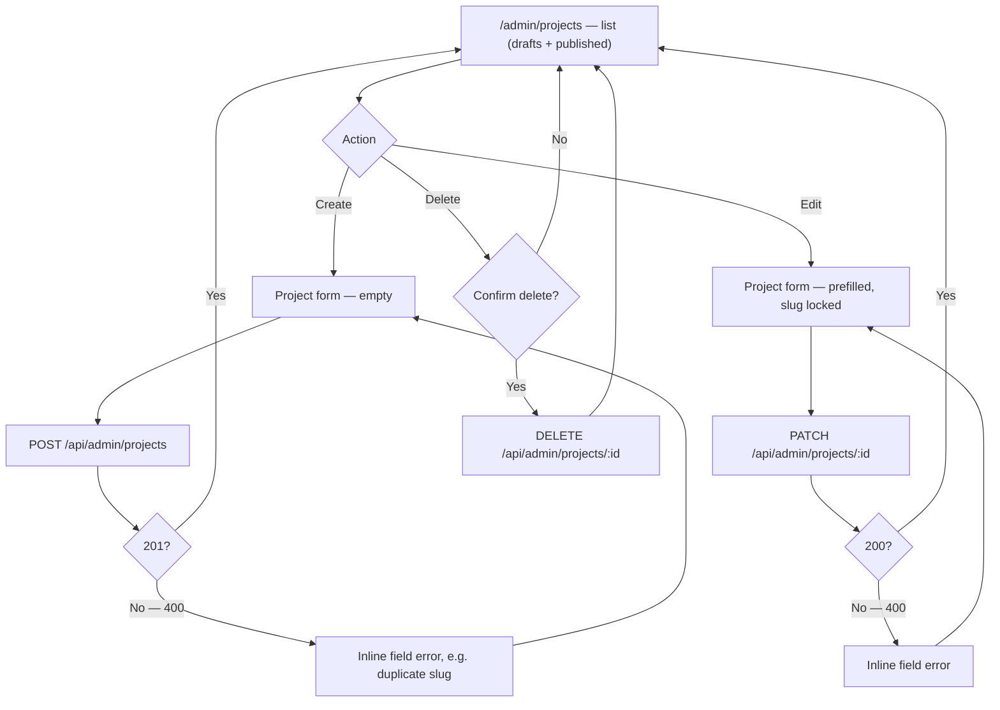

# Goal

As the site owner, I want to create, edit, publish/unpublish, and delete projects from the admin
dashboard, so that I can keep my portfolio current without a code deploy.

## Description

- **What it is:** a list view at `/admin/projects` (inside the dashboard shell from story `002`
  — depends on it) plus a create/edit form, giving full CRUD over the `Project` resource.
- **Backend is already built and verified** — this story is frontend-only. Endpoints per
  [`docs/07-api-contract.md`](../07-api-contract.md#4-projects): `GET /api/admin/projects` (all
  projects including drafts), `POST /api/admin/projects`, `PATCH /api/admin/projects/:id`,
  `DELETE /api/admin/projects/:id`. All four were exercised end to end against a real database
  when the backend was built — this story is the UI in front of them, not new business logic.
- **List view:** every project (draft and published), with a clear draft/published indicator and
  a featured indicator, edit and delete actions per row.
- **Form fields:** `slug` (locked/read-only when editing — the API rejects changing it, contract
  §4), `title`, `summary`, `problem`, `role`, `outcome`, `stack` (tag-style input for the string
  array), `imageUrl`, `repoUrl`, `demoUrl` (both optional), `featured` and `published` toggles.
- **Errors:** validation failures from the API (400, e.g. duplicate/malformed slug) surface
  inline against the relevant field, not as a generic toast.
- **Delete:** confirmation required before the `DELETE` call — this is destructive and
  irreversible.



```text
  /admin/projects (list)                    Project form
  ┌────────────────────────────────┐        ┌──────────────────────────┐
  │ [+ New project]                │        │ Slug     [locked-on-edit]│
  │──────────────────────────────  │        │ Title    [____________] │
  │ ● Ledgerline      Published ★  │ [Edit] │ Summary  [____________] │
  │   [Delete]                     │ [Del]  │ Problem  [____________] │
  │──────────────────────────────  │        │ Role     [____________] │
  │ ○ New Draft        Draft       │ [Edit] │ Outcome  [____________] │
  │   [Delete]                     │ [Del]  │ Stack    [tag][tag][+]  │
  │──────────────────────────────  │        │ Image URL[____________] │
  │ ...                            │        │ Repo/Demo URL (optional)│
  │                                 │        │ [x] Featured [x] Publish│
  │                                 │        │        [ Save ]         │
  └────────────────────────────────┘        └──────────────────────────┘
```

## UACs

**Status: 6/6 confirmed.** The 3 that were blocked on Epic 7.2 (public `/projects` page not
wired to real data) were re-verified against the real, now-live public page once
[`007-public-pages-real-data.md`](done/007-public-pages-real-data.md) shipped —
`e2e/tests/003-admin-manage-projects.spec.ts` now asserts against the rendered public page
directly (in addition to the API checks that were already there), not just the API.

- ~~Demo that `/admin/projects` lists every project including unpublished drafts, with a visible
  published/draft indicator per row.~~
- ~~Demo that creating a new project with valid fields adds it to the list as a draft
  (`published: false`) by default, and it does **not** appear on the public `/projects` page.~~
- ~~Demo that toggling `published` on an existing project makes it appear on the public
  `/projects` page immediately (no rebuild), and toggling it back off removes it from public
  view immediately.~~
- ~~Demo that submitting a duplicate or malformed slug on create shows the exact validation error
  the API returns, not a generic failure message.~~
- ~~Demo that the slug field is locked/uneditable when editing an existing project, matching the
  API's immutable-slug rule.~~
- ~~Demo that deleting a project requires a confirmation step, then removes it from both the admin
  list and the public site.~~
