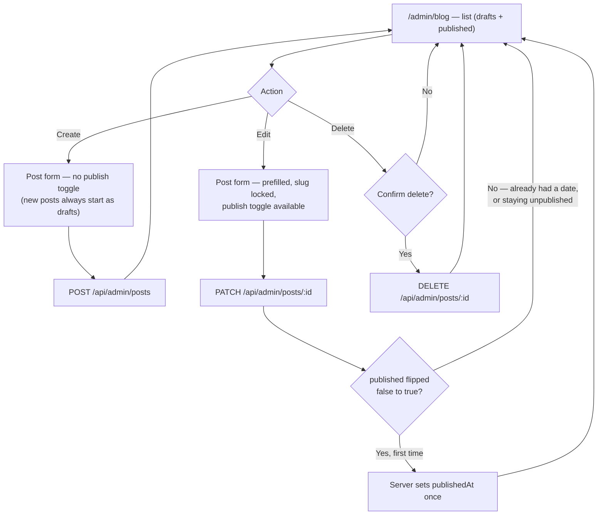

# Goal

As the site owner, I want to write, edit, and publish/unpublish blog posts from the admin
dashboard, so that publishing doesn't require a code deploy.

## Description

- **What it is:** a list view at `/admin/blog` (inside the dashboard shell from story `002`)
  plus a create/edit form, giving full CRUD over the `Post` resource.
- **Backend is already built and verified** — frontend-only story. Endpoints per
  [`docs/07-api-contract.md`](../07-api-contract.md#5-posts): `GET /api/admin/posts` (all posts
  including drafts), `POST /api/admin/posts`, `PATCH /api/admin/posts/:id`, `DELETE
  /api/admin/posts/:id`.
- **The one rule worth calling out explicitly:** a post's `publishedAt` is set exactly once, the
  first time `published` flips to `true` — unpublishing and re-publishing later never overwrites
  it (already implemented and tested on the backend, contract §5). The UI doesn't need to
  enforce this itself, just not fight it — e.g. don't show an editable "publish date" field that
  implies the owner can backdate/change it.
- **List view:** every post (draft and published), with a draft/published indicator and the
  publish date (or "—" while still a draft).
- **Form fields:** `slug` (locked when editing, same immutability rule as projects), `title`,
  `excerpt`, `content` (plain text/paragraphs — matches the current content model, no rich editor
  requirement), `imageUrl`, `readMinutes`, and a `published` toggle. Note: `POST
  /api/admin/posts` never accepts `published` on create (contract §5 — every post starts as a
  draft); the form's create mode simply has no publish toggle at all, only the edit mode does.
- **Errors:** validation failures (400) surface inline against the relevant field.
- **Delete:** confirmation required before the `DELETE` call.



```text
  /admin/blog (list)                        Post form (edit mode)
  ┌────────────────────────────────┐        ┌──────────────────────────┐
  │ [+ New post]                   │        │ Slug     [locked]        │
  │──────────────────────────────  │        │ Title    [____________] │
  │ ● Designing APIs   May 12, '26 │ [Edit] │ Excerpt  [____________] │
  │   [Delete]                     │ [Del]  │ Content  [____________] │
  │──────────────────────────────  │        │          [____________] │
  │ ○ Draft: New idea   —          │ [Edit] │ Image URL[____________] │
  │   [Delete]                     │ [Del]  │ Read min [__]           │
  │──────────────────────────────  │        │ [x] Published            │
  │                                 │        │        [ Save ]         │
  └────────────────────────────────┘        └──────────────────────────┘
```

## UACs

**Status: 6/6 confirmed.** The 3 that were blocked on Epic 7.2 (public `/blog` page not wired to
real data) were re-verified against the real, now-live public page once
[`007-public-pages-real-data.md`](done/007-public-pages-real-data.md) shipped —
`e2e/tests/004-admin-manage-blog.spec.ts` now asserts against the rendered public page directly
(in addition to the API checks that were already there), not just the API.

- ~~Demo that `/admin/blog` lists every post including drafts, showing the publish date for
  published posts and a clear "not published" indicator for drafts.~~
- ~~Demo that creating a new post has no publish toggle and always saves as a draft — it does
  **not** appear on the public `/blog` page.~~
- ~~Demo that editing an existing post exposes a publish toggle, and flipping it on makes the post
  appear on the public `/blog` page immediately.~~
- ~~Demo that unpublishing a previously-published post, then publishing it again, keeps the
  original publish date rather than showing a new one — the UI reflects the backend's
  set-once rule, doesn't try to override it.~~
- ~~Demo that submitting a duplicate or malformed slug on create shows the exact validation error
  the API returns.~~
- ~~Demo that deleting a post requires confirmation, then removes it from both the admin list and
  the public site.~~
