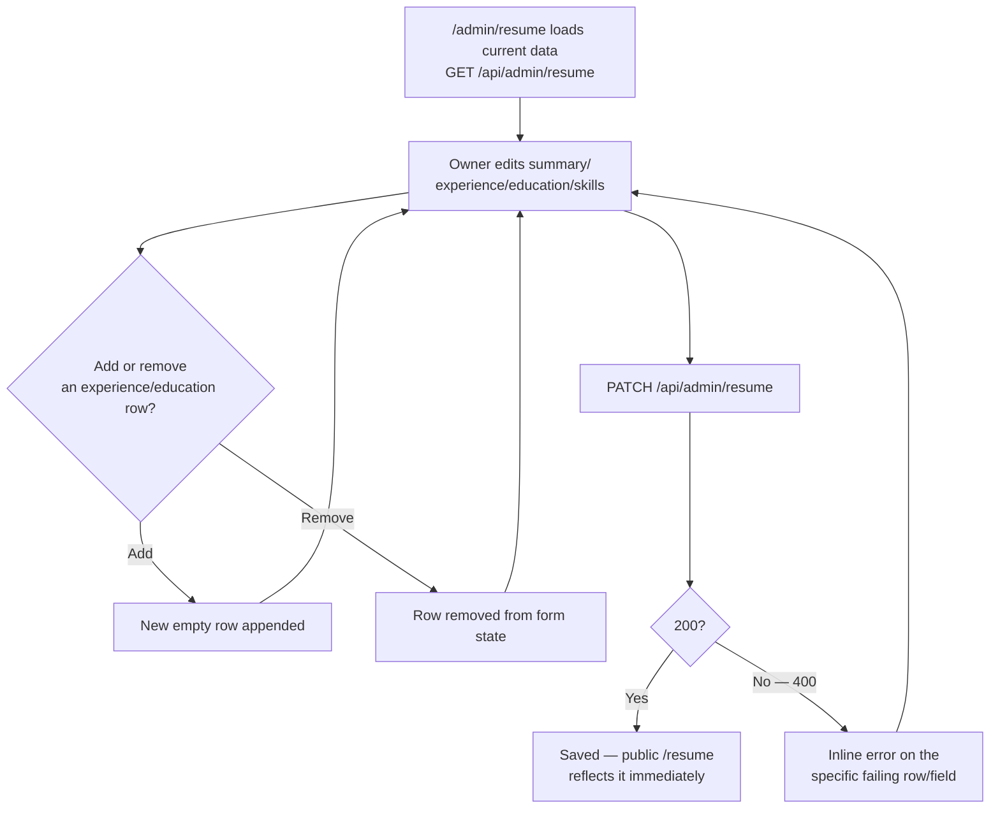

# Goal

As the site owner, I want to edit my resume's summary, experience, education, and skills from
the admin dashboard, so that my public Resume page stays current without a code change.

## Description

- **What it is:** a single edit form at `/admin/resume` (inside the dashboard shell from story
  `002`) — there's no list view, since `resume` is a single-row resource (one owner, one
  resume).
- **Backend is already built and verified for the text fields** — `PATCH /api/admin/resume`
  (contract §6) accepts `summary`, `experience[]`, `education[]`, `skills[]`, with nested
  validation on each experience/education entry's shape. That part of this story is
  frontend-only.
- **Explicitly out of scope: PDF upload.** `POST /api/admin/resume/pdf` is **not built yet** — it
  needs Supabase Storage integration that hasn't happened
  ([`docs/05-user-stories.md`](../05-user-stories.md) 4.2 status). This story's form edits the
  on-page resume data only. Don't build an upload control against an endpoint that doesn't
  exist — if the form wants to acknowledge the PDF at all, a disabled "Upload PDF (coming soon)"
  affordance is the honest way to do it, not a functional-looking button that 404s.
- **Form shape:**
  - `summary` — a textarea.
  - `experience[]` — repeatable rows (role, org, period, points[] as a multi-line or tag-style
    list), with add/remove controls.
  - `education[]` — repeatable rows (school, credential, period), add/remove.
  - `skills[]` — tag-style input, same pattern as `stack` on the Projects form (story `003`) —
    reuse that component rather than building a second tag input.
- **Errors:** the API validates each experience/education entry's shape — surface which specific
  row/field failed, not just "invalid request."



```text
  /admin/resume
  ┌────────────────────────────────────────────────────┐
  │ Summary                                             │
  │ [________________________________________________] │
  │                                                      │
  │ Experience                              [+ Add row] │
  │ ┌──────────────────────────────────────────┐ [x]    │
  │ │ Role [______] Org [______] Period [_____] │        │
  │ │ Points: [•] [•] [•] [+]                   │        │
  │ └──────────────────────────────────────────┘        │
  │                                                      │
  │ Education                               [+ Add row] │
  │ ┌──────────────────────────────────────────┐ [x]    │
  │ │ School [____] Credential [____] Period [_]│        │
  │ └──────────────────────────────────────────┘        │
  │                                                      │
  │ Skills  [tag][tag][tag][+]                          │
  │                                                      │
  │ PDF: (coming soon — upload not built yet)           │
  │                                          [ Save ]    │
  └────────────────────────────────────────────────────┘
```

## UACs

**Status: 5/5 confirmed.** UACs 2 and 3 were unblocked by
[`007-public-pages-real-data.md`](done/007-public-pages-real-data.md) and re-verified against
the real, now-live public `/resume` page. UAC 4 was a genuinely different, unrelated finding —
the backend's `ResumeExperienceDto`/`ResumeEducationDto`
(`backend/src/resume/dto/update-resume.dto.ts`) validated *type* (`@IsString()`) but not
*presence*, so an omitted field 400'd correctly but an empty string (all the admin form's
controlled inputs ever send) silently passed. Fixed by adding `@IsNotEmpty()` alongside
`@IsString()` on every identifying field (`role`/`org`/`period`, `school`/`credential`/`period`);
`docs/07-api-contract.md` §6 updated to state the non-empty requirement explicitly.
`e2e/tests/005-admin-manage-resume.spec.ts`'s UAC 4 tests now cover both the API-level shapes
and, for the first time, the real admin form actually triggering and displaying the row-specific
error — previously undemonstrable through the UI, now genuinely reachable.

- ~~Demo that `/admin/resume` loads pre-filled with the current summary, experience, education,
  and skills from the API.~~
- ~~Demo that adding an experience row, filling it in, and saving persists it — the public
  `/resume` page reflects the new entry immediately.~~
- ~~Demo that removing an experience or education row and saving actually removes it from the
  public page too, not just the form.~~
- ~~Demo that submitting an incomplete experience/education row (e.g. missing `role`) shows the
  validation error against that specific row, not a generic failure.~~
- ~~Demo that there is no functional PDF upload control — either it's absent entirely or clearly
  marked as not yet available, and nothing on this screen implies the PDF can be changed today.~~
