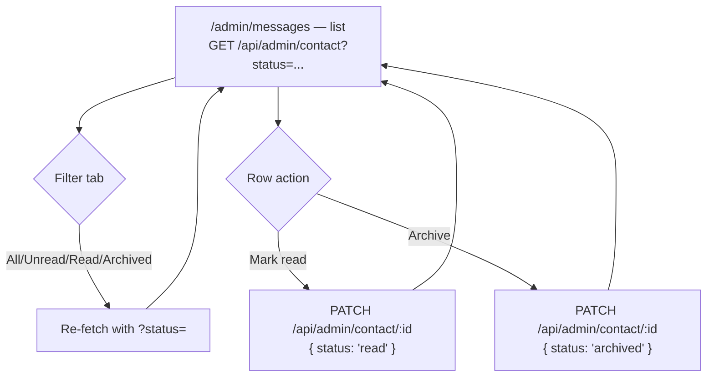

# Goal

As the site owner, I want to view and triage contact form submissions from the admin dashboard,
so I don't miss recruiter outreach and can keep track of what I've already dealt with.

## Description

- **What it is:** a list view at `/admin/messages` (inside the dashboard shell from story `002`)
  for `ContactSubmission` records — read and status-update only, no create/delete (submissions
  come from the public contact form, not from the admin).
- **Backend is already built and verified** — frontend-only story. Endpoints per
  [`docs/07-api-contract.md`](../07-api-contract.md#7-contact): `GET /api/admin/contact` (with
  an optional `?status=unread|read|archived` filter) and `PATCH /api/admin/contact/:id` (body
  `{ status: "read" | "archived" }` — `unread` is not a settable target via this route, only the
  initial state on creation).
- **List view:** name, email, message, submitted date, and status per row, newest first.
  Status-filter tabs (All / Unread / Read / Archived) map directly to the `?status=` query param.
- **Actions per row:** mark as read, archive. No "mark unread again" control — the API doesn't
  support it (contract §7), and the UI shouldn't offer an action the backend will reject.
- **No pagination** — matches the API contract's v1 scope (every list endpoint returns the full
  set); this list isn't expected to grow large enough for that to matter yet.
- **Public side note (out of scope for this story):** the contact form itself already validates
  and submits successfully client-side (`frontend/src/pages/Contact.tsx`), but its submission
  currently only simulates success (`TODO` in that file) rather than calling the real `POST
  /api/contact`. Wiring the public form to the real endpoint is Epic 5.1's remaining work, not
  this story — this story is the admin-side viewer for whatever submissions do exist.



```text
  /admin/messages
  ┌──────────────────────────────────────────────────────────┐
  │ [All] [Unread] [Read] [Archived]                          │
  │────────────────────────────────────────────────────────  │
  │ ● Jane Recruiter <jane@co.com>        Jul 18   [Read][Arch]│
  │   "Loved your portfolio, would love to chat..."            │
  │────────────────────────────────────────────────────────  │
  │ ○ Sam Interviewer <sam@co.com>        Jul 17   [Read][Arch]│
  │   "Quick question about your Ledgerline project..."        │
  │────────────────────────────────────────────────────────  │
  │ ...                                                        │
  └──────────────────────────────────────────────────────────┘
    ● = unread   ○ = read/archived (visually de-emphasized)
```

## UACs

**Status: 5/5 confirmed.** No public-facing page for this feature, so — unlike `003`/`004`/`005`
— nothing here depends on Epic 7.2.

- ~~Demo that `/admin/messages` lists all contact submissions, newest first, with name, email,
  message, date, and status visible per row.~~
- ~~Demo that switching the filter tab (All/Unread/Read/Archived) re-fetches and shows only
  matching submissions, using the API's `?status=` param.~~
- ~~Demo that clicking "mark read" on an unread submission updates its status and the row reflects
  that immediately.~~
- ~~Demo that archiving a submission moves it out of the "Unread" and "Read" filtered views into
  "Archived".~~
- ~~Demo that there is no "mark unread" action anywhere in the UI — matching that the API doesn't
  support setting status back to `unread`.~~
