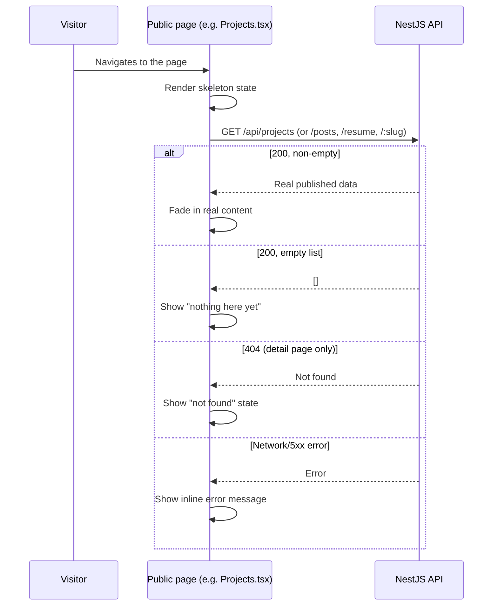

# Goal

As a visitor, I want the Projects, Blog, and Resume pages to show content the owner actually
published, so that the site reflects reality instead of hardcoded placeholder data.

## Description

- **What it is:** replace the direct `frontend/src/data/content.ts` imports for projects, posts,
  and resume with real fetches against the already-built, already-verified backend
  ([`docs/07-api-contract.md`](../07-api-contract.md)):
  - `Projects.tsx` → `GET /api/projects`
  - `ProjectDetail.tsx` → `GET /api/projects/:slug`
  - `Blog.tsx` → `GET /api/posts`
  - `BlogDetail.tsx` → `GET /api/posts/:slug`
  - `Resume.tsx` → `GET /api/resume`
  - `Home.tsx`'s featured-projects section → `GET /api/projects`, filtered to `featured`
    (already returned; filter client-side same as today, or ask the API — no new endpoint
    needed either way)
- **This is the fix for the recurring blocker** flagged across `docs/tasks/003-admin-manage-
  projects.md`, `004-admin-manage-blog.md`, and `005-admin-manage-resume.md` — each has UACs
  that couldn't be demoed against the real public page because it still rendered mock data.
  Closing this story should let those open UACs finally be confirmed (re-verify them once this
  ships, rather than assuming — same discipline as every other story here).
- **Explicitly out of scope:**
  - **Profile/bio data** (Home's intro copy, the About page, Footer, Contact page's social
    links) — there's no `profile` table in the schema at all (only `projects`, `posts`,
    `resume`, `contact_submissions`), so this isn't a small wiring change like the others, it's
    new schema + a new admin story. Those keep reading from `content.ts` as static content for
    now — just make sure the real bio/skills content (already written into
    `supabase/seed-content.yaml`) is what's sitting in `content.ts`, not old placeholder text.
  - **Wiring the public contact form's submission** to `POST /api/contact` — that's Epic 5.1,
    a separate tracked gap (`Contact.tsx` has its own `TODO`), unrelated to this story's
    read-only data display.
- **New public API module:** a small `frontend/src/api/` fetch wrapper for these GET-only public
  reads, mirroring the shape of the existing admin one (`frontend/src/admin/api/client.ts`) but
  with no auth handling needed (these are unauthenticated public routes).
- **Known wrinkle — type shapes don't match:** `content.ts`'s mock types don't line up with the
  real API's JSON shape (e.g. mock `Project.image` vs the API's `imageUrl`; no `id`, `published`,
  `createdAt`/`updatedAt` in the mock types at all). New types matching
  `docs/07-api-contract.md`'s actual shapes are needed — don't assume `content.ts`'s existing
  types can just be reused as-is.
- **Loading/error/empty states**, per `docs/05-user-stories.md` 7.2's "fail gracefully, not a
  blank crash" requirement:
  - **Loading:** a skeleton state that fades into the real content once loaded (matching the
    site's existing `Reveal`/motion patterns), not a layout jump.
  - **Error** (API unreachable/non-2xx): a plain-language inline message replacing the section
    ("Couldn't load projects right now." or similar), not a blank page or thrown error.
  - **Empty** (successful response, zero items — e.g. no published projects yet): a plain
    "nothing here yet" message, not a broken/empty-looking layout.
  - **Not found** (detail page, slug doesn't match any published item): a clear "not found"
    state, not a crash — this can happen legitimately (unpublished/deleted since the link was
    shared).



```text
  Projects.tsx — representative of the shared loading/error/empty pattern
  applied to Projects, Blog, and Resume alike.

  Loading:                        Loaded:
  ┌─────────────────────────┐     ┌─────────────────────────┐
  │ ░░░░░░░░  ░░░░░░░░░░░░  │     │ Cura Mobile App          │
  │ ░░░░░░░░  ░░░░░░░░░░░░  │ --> │ A mobile app that...     │
  │ ░░░░░░░░  ░░░░░░░░░░░░  │     │ [React Native] [AWS]     │
  └─────────────────────────┘     └─────────────────────────┘
       (skeleton, faded)                (fades in)

  Error:                           Empty:
  ┌─────────────────────────┐     ┌─────────────────────────┐
  │  Couldn't load projects  │     │   No projects yet.       │
  │  right now.               │     │   Check back soon.       │
  └─────────────────────────┘     └─────────────────────────┘
```

## UACs

**Status: 8/8 confirmed**, all against real seeded data (`supabase/seed.sql`,
`docs/08-seed-data.md`) rather than assumed — including two genuine cases that fell out of that
real data for free: `nail-salon-website` (real project, `published: false`) demonstrated the
not-found path, and the real absence of any seeded blog post demonstrated the empty-state path,
neither one contrived.

- ~~Demo that `/projects` lists only real, published projects fetched from the API — matching
  what's actually marked `published` in the database, not `content.ts`'s mock data.~~
- ~~Demo that `/projects/:slug` renders a real project's full detail from the API, and that an
  unpublished or nonexistent slug shows a clear "not found" state instead of a crash.~~
- ~~Demo that `/blog` lists only real, published posts fetched from the API, not mock data.~~
- ~~Demo that `/blog/:slug` renders a real post's full detail from the API, with the same
  not-found handling as projects.~~
- ~~Demo that `/resume` renders the real summary, experience, education, and skills from the API,
  not mock data.~~
- ~~Demo that the Home page's featured-projects section pulls real featured + published projects
  from the API, not mock data.~~
- ~~Demo that if the API is unreachable (stop the backend and reload), each affected page shows a
  clear inline error message instead of a blank page or a thrown error.~~ Verified via
  `page.route()` network-failure simulation per page rather than actually stopping the shared
  dev backend (which would have broken every other concurrently-running test) — same real code
  path, non-destructive trigger.
- ~~Demo that a successful-but-empty response (e.g. zero published projects) shows a plain empty
  state, not a broken or blank-looking layout.~~ Blog's empty state is demonstrated against real
  data (zero seeded posts); Projects' empty state is demonstrated via `page.route()` returning a
  real `200` with `[]`, rather than temporarily unpublishing real portfolio content just to
  produce the same state destructively.

### Bugs found and fixed along the way (out of scope, but blocking a clean regression run)

- **Real, pre-existing data-destructive bug in `e2e/tests/005-admin-manage-resume.spec.ts`:**
  its UAC 4 test's "cleanup" step unconditionally `PATCH`ed `experience: []`, wiping the entire
  resume experience array — harmless before real seed data existed (nothing to lose), actively
  destructive now (it silently deleted the real Consultation SOS / Robotics Club entries the
  first time this suite ran against real data). Its UAC 2 test also never cleaned up its own
  added row at all. Both now capture and restore the real pre-test experience array instead of
  wiping it — caught by this story's full-suite regression run, not assumed clean.
- **Real responsive layout bug in `AdminProjectsList.tsx` / `AdminBlogList.tsx`:** on a narrow
  (mobile) viewport, `ConfirmDeleteButton`'s expanded "Delete? Confirm Cancel" state squeezed
  the row's title text to zero width — invisible, not just truncated — because the actions
  group was `shrink-0` and the title was the only flexible item left to absorb the overflow.
  Fixed with `flex-wrap` on the row so actions wrap to their own line instead of erasing the
  title. Caught by `004-admin-manage-blog.spec.ts`'s existing UAC 6 test failing on
  `mobile-chromium` during this story's regression run — a real bug, not a flaky test.
